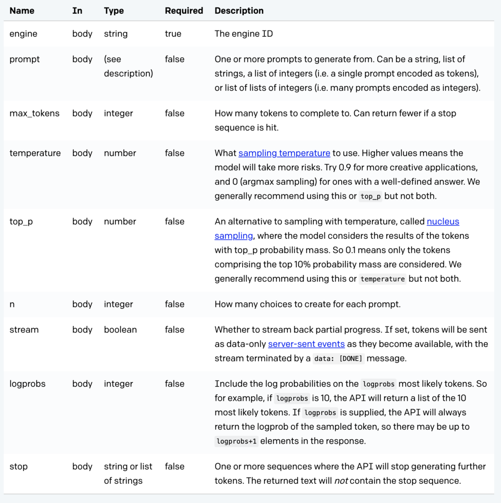

# Adding experiments 

You can simply modify [process.py](https://github.com/friedeggs/in-context_learning/blob/master/process.py) so that Percy only needs to run [./eval_gpt3.sh](https://github.com/friedeggs/in-context_learning/blob/master/eval_gpt3.sh). 

For example, you can add your experiments in a separate file similar to [the phonetics task suite](https://github.com/friedeggs/in-context_learning/blob/master/prompts_from_chris.py), then in [process.py](https://github.com/friedeggs/in-context_learning/blob/master/process.py), import your tasks and add a line to the bottom of the `main` function. 

Outputs will be written to `jamie:/u/pliang/results` by default. 

API documentation for the `openai.Completion.create` function is here:
<!-- {:height="700px" width="400px"} -->

There are four main engines: `ada`, `babbage`, `curie`, and (most advanced) `davinci`. 

Please note that this repository is **under active development**! Send questions and comments to @friedeggs. 
